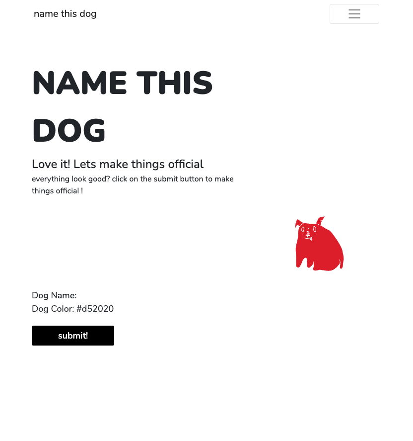

# Name This Dog !

Navigate This README:
- [Name This Dog !](#name-this-dog-)
  - [Application Overview](#application-overview)
  - [Features/Tools](#featurestools)
  - [Screenshots of application](#screenshots-of-application)
    - [More Information](#more-information)
    - [CRUD Breakdown](#crud-breakdown)
      - [Create](#create)
      - [Read](#read)
      - [Update](#update)
      - [Delete](#delete)
    - [App Update!](#app-update)

  
  

## Application Overview

Name This Dog! is a custom dog generator that allows users to input a name and color to create their own dog post. Posts are displayed realtime in the gallery. Once in the gallery, the dogs can be "sent" somewhere (updating their backgrounds) by using the drop down input on the post cards. Sending the dog "home" will remove the dog from the gallery and database and send the dog safely and happily back home. 

> Visit the app and create your own dog! [Name This Dog Firebase App](https://arh-final.web.app/)

## Features/Tools
- Responsive, Mobile-first Design
- React Router
- Firebase
  - Realtime database
  - Hosting
- Bootstrap Component Library
- React.js
- SVG Dog Illustrations
  - Drafted: Procreate App
  - Designed: Adobe Illustrator
  - Sprite: svgsprit.es & SVGR
  
## Screenshots of application

 (Functional) Original Application <a href="https://arh-final.web.app">Visit Site</a>

> 

> URL: [arh-final.web.app](https://arh-final.web.app/)

 (WIP) Updated Visual Design <a href="https://name-this-dog.web.app">Visit Site</a>

>

> URL: [Name-This-Dog.web.app](https://name-this-dog.web.app/)

| Name                         | Color                          | Submit                     |
| ---------------------------- | ------------------------------ | -------------------------- |
|  |  |  |

 (WIP) Updated Visual Design: Responsive Navigation

| NavBar (Desktop)       | NavMenu (Mobile)                          | Open NavMenu (Mobile)                 |
| ---------------------- | ----------------------------------------- | ------------------------------------- |
|  |  |  |

--- 

### More Information

This application implements a RESTFUL backend API for securely storing and retrieving data in a NoSQL database via AJAX calls. The purpose of creating this app was to examine the techniques used in multimedia applications to communicate with back-end data and information services, and to create applications with run-time access to data, information, and media assets. This is a CRUD SPA featuring a form on a styled, responsive website built with React, Bootstrap, and Firebase. SVGs designed for this application were created using adobe illustrator, procreate, svgsprit.es, and SVGR. 

### CRUD Breakdown

Application form creates an object ("dog") from user input data and stores the information in a database (Firebase). All objects are updated and displayed on the page ("cards")

#### Create 
User input consists of text, color, and submit. Color selector updates "preview" dog color as user selects colors. Submitting the form ("Add to list") sends the name property (text input) and color property (color input) to Firebase database along with the property "somewhere" set to its default value.

#### Read
Objects are displayed styled with bootstrap cards. The "color" property sets the card SVG ("dog") color and also displays as hexidecimal value on the card

#### Update
The "somewhere" property determines the background image for the dog "card." Default value displays no background image. User can update the somewhere property by using the "Go Somewhere" selector

#### Delete
Setting the somewhere property to "Go Home!" will delete the object from the database

---

### App Update! 

Site is being updated and moved to another firebase app url. The updated app is still in progress and only for visual design purposes (does not function functionally yet)

> Updated App (visual design only): [Name-This-Dog.web.app](https://name-this-dog.web.app/)

